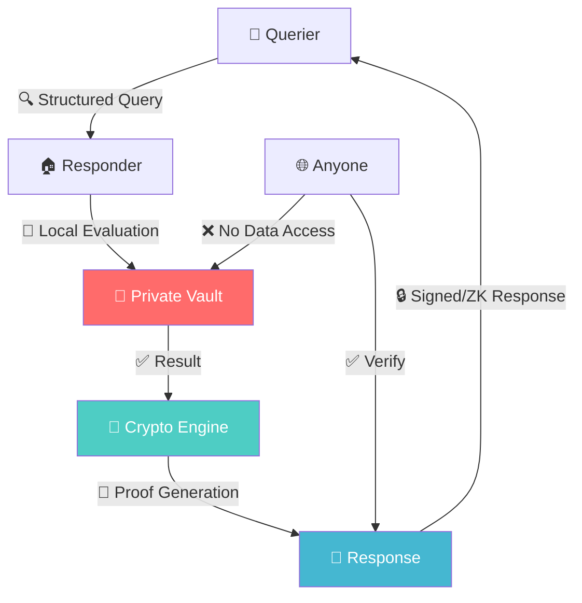

<div align="center">

# 🔐 Verifiable Query Protocol (VQP)

[](https://opensource.org/licenses/MIT)
[](https://github.com/vqp-protocol/vqp)
[](./docs/spec.md)

### *The Future of Privacy-Preserving Data Verification*

> **Ask without accessing.**  
> **Prove without revealing.**  
> **Verify without trusting.**

---

*What if you could verify someone's age without seeing their birth date?*  
*What if services could prove their uptime without exposing internal metrics?*  
*What if compliance could be verified without auditing private systems?*

**Welcome to the era of sovereign data verification.**

</div>

---

## 🚀 The Revolution Starts Here

**VQP (Verifiable Query Protocol)** is the first open protocol that enables **cryptographically verifiable queries over private data** without ever exposing the underlying information. 

### The Problem We're Solving

In today's digital world, verification requires exposure:
- 🔴 **Age verification** → Upload government ID
- 🔴 **Income verification** → Share bank statements  
- 🔴 **Health verification** → Provide medical records
- 🔴 **System compliance** → Allow external audits

**This is broken. Data sovereignty is dead.**

### The VQP Solution

With VQP, verification becomes sovereign:
- ✅ **Age verification** → Prove `age >= 18` with Zero-Knowledge
- ✅ **Income verification** → Prove `income > $50k` with cryptographic signatures
- ✅ **Health verification** → Prove vaccination status without medical history
- ✅ **System compliance** → Prove uptime without exposing internal metrics

---

## 📦 Installation

**VQP is built with a modular architecture.** Install only the components you need:

```bash
# Core VQP functionality
npm install @vqp/core

# Add specific adapters as needed
npm install @vqp/data-filesystem    # File-based data storage
npm install @vqp/crypto-software    # Software-based cryptography
npm install @vqp/audit-console      # Console logging
npm install @vqp/evaluation-jsonlogic # JSONLogic evaluation

# Or install everything at once
npm install @vqp/core @vqp/data-filesystem @vqp/crypto-software @vqp/audit-console @vqp/evaluation-jsonlogic
```

### Requirements

- **Node.js**: >= 18.0.0
- **TypeScript**: >= 5.0.0 (optional but recommended)

### Modular Architecture Benefits

- 🎯 **Minimal Bundle Size**: Only include what you need
- 🔧 **Technology Independence**: Swap adapters without changing core logic
- 🧪 **Easy Testing**: Mock adapters for comprehensive testing
- 📦 **Platform Flexibility**: Deploy to any environment

---

## ⚡ Quick Start

```typescript
import { VQPService, QueryBuilder } from '@vqp/core';
import { createFileSystemDataAdapter } from '@vqp/data-filesystem';
import { createSoftwareCryptoAdapter } from '@vqp/crypto-software';
import { createConsoleAuditAdapter } from '@vqp/audit-console';
import { createJSONLogicAdapter } from '@vqp/evaluation-jsonlogic';

// 1. Create a VQP responder (data owner)
const vqpService = new VQPService(
  await createFileSystemDataAdapter({ vaultPath: './vault.json' }),
  await createSoftwareCryptoAdapter({ keyId: 'my-service-key' }),
  await createConsoleAuditAdapter(),
  await createJSONLogicAdapter()
);

// 2. Build and process queries
const query = new QueryBuilder()
  .requester('did:web:service.com')
  .vocabulary('vqp:identity:v1')
  .expression({ ">=": [{ "var": "age" }, 18] })
  .build();

const response = await vqpService.processQuery(query, {
  'vqp:identity:v1': { /* vocabulary schema */ }
});

// Simple comparison query
const ageQuery = QueryBuilder.compare(
  'did:web:my-service.com',
  'vqp:identity:v1', 
  'age', 
  '>=', 
  18
);

// Complex conditional query
const loanEligibilityQuery = QueryBuilder.and(
  'did:web:my-service.com',
  'vqp:financial:v1',
  [
    { '>=': [{ var: 'annual_income' }, 50000] },
    { '<=': [{ var: 'debt_to_income_ratio' }, 0.4] },
    { '>=': [{ var: 'credit_score' }, 650] }
  ]
);

// Raw JSONLogic for ultimate flexibility
const customQuery = QueryBuilder.fromExpression(
  'did:web:my-service.com',
  'my-company:custom:v1',
  {
    and: [
      { '==': [{ var: 'clearance_level' }, 'confidential'] },
      { in: ['AI_RESEARCH', { var: 'projects' }] }
    ]
  }
);

// 3. Process and verify responses directly
const vqpService = vqpSystem.getService();
const response = await vqpService.processQuery(ageQuery);

// Verification without stateful session management
const crypto = new SoftwareCryptoAdapter();
const verifier = new VQPVerifier(crypto);
const isValid = await verifier.verifyComplete(response, ageQuery.id);

if (isValid.overall) {
  console.log('✅ Verification passed (no data was exposed!)');
}

// 4. Optional: Helper functions for identity-bound queries
function createMyQueries(identity: string) {
  return {
    ageCheck: (minAge: number) => 
      QueryBuilder.compare(identity, 'vqp:identity:v1', 'age', '>=', minAge),
    incomeCheck: (minIncome: number) =>
      QueryBuilder.compare(identity, 'vqp:financial:v1', 'annual_income', '>=', minIncome)
  };
}

const myQueries = createMyQueries('did:web:my-app.com');
const quickAgeQuery = myQueries.ageCheck(21);
```

---

## 🔧 Advanced Usage

### Modular Architecture with Subpath Imports

VQP follows hexagonal architecture and provides modular adapters. You can import specific components:

```typescript
// Import specific crypto adapters
import { SoftwareCryptoAdapter, SnarkjsCryptoAdapter } from '@vqp/core/crypto';

// Import data adapters
import { FileSystemDataAdapter, EncryptedDataAdapter } from '@vqp/core/data';

// Build custom VQP system with specific adapters
const vqpSystem = createVQPSystem({
  data: { 
    adapter: new EncryptedDataAdapter({
      vaultPath: './encrypted-vault.json',
      encryptionKey: process.env.VAULT_KEY
    })
  },
  crypto: { 
    adapter: new SoftwareCryptoAdapter({
      keyPath: './keys/private.key'
    })
  }
});
```

### Zero-Knowledge Proofs

For maximum privacy, use ZK-SNARK proofs that prove statements without revealing underlying data:

```typescript
import { SnarkjsCryptoAdapter } from '@vqp/core/crypto';

// Use ZK proofs for maximum privacy
const zkCrypto = new SnarkjsCryptoAdapter({
  circuitPath: './circuits/age_verification.r1cs',
  provingKeyPath: './circuits/proving.key',
  verificationKeyPath: './circuits/verification.key'
});

const privateVQP = createVQPSystem({
  crypto: zkCrypto,
  // ... other adapters
});

// Age verification with ZK proof
const zkResponse = await querier.query(endpoint, {
  vocab: 'vqp:identity:v1',
  expr: { '>=': [{ 'var': 'age' }, 21] }
});

// Response includes ZK proof instead of signature
console.log(zkResponse.proof.type); // 'zk-snark'
```

### Custom Vocabularies

```typescript
// Define custom vocabulary for your domain
const customVocab = {
  "$schema": "https://json-schema.org/draft/2020-12/schema",
  "properties": {
    "security_clearance": {
      "type": "string",
      "enum": ["public", "secret", "top_secret"]
    },
    "years_experience": {
      "type": "integer",
      "minimum": 0
    }
  }
};

// Query using custom vocabulary
const response = await querier.query(endpoint, {
  vocab: 'https://mycompany.com/vqp/vocab/hr/v1',
  expr: {
    "and": [
      { ">=": [{ "var": "security_clearance" }, "secret"] },
      { ">=": [{ "var": "years_experience" }, 5] }
    ]
  }
});
```

---

## ⚡ Mind-Blowing Use Cases

<table>
<tr>
<td width="50%">

### 🏦 **Financial Services**
```javascript
// Loan application without bank statements
query: "annual_income >= 75000 AND 
        employment_duration >= 12_months"
response: true + cryptographic_proof
// Bank details: NEVER EXPOSED
```

</td>
<td width="50%">

### 🏥 **Healthcare**
```javascript
// Venue entry without medical records
query: "vaccinated('COVID-19') AND 
        doses >= 2"
response: true + zk_proof
// Medical history: NEVER EXPOSED
```

</td>
</tr>
<tr>
<td>

### 🎓 **Identity Verification**
```javascript
// Online service without document sharing
query: "age >= 21 AND 
        citizenship == 'US'"
response: true + signature
// Personal documents: NEVER EXPOSED
```

</td>
<td>

### 🏢 **Enterprise Compliance**
```javascript
// Vendor verification without system access
query: "iso27001_certified AND 
        last_audit <= 365_days"
response: true + multisig_proof
// Internal systems: NEVER EXPOSED
```

</td>
</tr>
</table>

---

## 🧠 The Architecture That Changes Everything



### **Core Innovation: JSONLogic + Cryptographic Proofs**

```typescript
// Query Structure (JSONLogic-based)
{
  "id": "uuid-v4",
  "version": "1.0.0", 
  "requester": "did:web:bank.example.com",
  "query": {
    "lang": "jsonlogic@1.0.0",
    "vocab": "vqp:financial:v1",
    "expr": {
      "and": [
        { ">=": [{ "var": "annual_income" }, 50000] },
        { "==": [{ "var": "employment_status" }, "employed"] }
      ]
    }
  }
}
```

```typescript
// Response (Cryptographically Verifiable)
{
  "queryId": "original-query-uuid",
  "result": true,
  "timestamp": "2025-06-11T14:44:00Z",
  "responder": "did:key:user-identity",
  "proof": {
    "type": "zk-snark",
    "circuit": "income_verification_v1",
    "proof": "0x1a2b3c...",
    "publicInputs": { "threshold": 50000 }
  }
}
```

---

## 🎯 Protocol Features That Blow Minds

### 🔒 **Multiple Proof Systems**
- **Digital Signatures** (Ed25519, secp256k1, RSA) - Fast & Universal
- **Zero-Knowledge Proofs** (zk-SNARKs, Bulletproofs) - Ultimate Privacy
- **Multi-Signatures** - Distributed Trust & Consensus

### 🧩 **Extensible by Design**
- **Protocol-First**: Core specification, not opinionated implementation
- **Any Vocabulary**: Use standards or define your own domain schemas
- **Custom Data Mappings**: Map vocabularies to any existing data structure
- **Any Query Pattern**: Generic QueryBuilder supports all JSONLogic expressions
- **Future-Proof**: Add new proof systems, vocabularies, and query types

### 📚 **Standard Vocabularies (Optional)**
- `vqp:identity:v1` - Age, citizenship, credentials
- `vqp:financial:v1` - Income, employment, credit
- `vqp:health:v1` - Vaccinations, conditions, insurance
- `vqp:metrics:v1` - Uptime, performance, system health
- `vqp:compliance:v1` - Certifications, audits, policies
- `vqp:academic:v1` - Degrees, enrollment, transcripts
- `vqp:supply-chain:v1` - Origin, certifications, traceability
- `vqp:iot:v1` - Sensor data, device status, environmental
- **+ Your Custom Vocabularies** - Define domain-specific schemas

### 🗺️ **Flexible Data Mapping**
- **Standard Mapping**: Works with predefined VQP vault structures
- **Flat Mapping**: For simple, flat data organizations
- **Custom Mapping**: Support any existing data structure without reorganization
- **Examples**: Employee systems, IoT hierarchies, multi-tenant architectures

### ⚡ **Performance That Scales**
- **Query Evaluation**: <100ms for complex expressions
- **Signature Generation**: <10ms (Ed25519)
- **ZK Proof Generation**: <5s (standard circuits)
- **Throughput**: 1000+ queries/second per node

---

## 🛠️ Developer Experience That Rocks

### **Quick Start (60 seconds)**

```bash
# Install VQP SDK
npm install @vqp/core @vqp/crypto

# Generate keys
vqp keygen --algorithm ed25519 --output ./keys/

# Start responder
vqp responder --vault ./my-vault.json --port 8080
```

```typescript
// Query someone's age (without knowing their birth date!)
import { QueryBuilder, VQPVerifier } from '@vqp/core';
import { SoftwareCryptoAdapter } from '@vqp/core';

// Build the query
const query = new QueryBuilder()
  .requester('did:web:my-service.com')
  .vocabulary('vqp:identity:v1')
  .expression({ '>=': [{ 'var': 'age' }, 18] })
  .build();

// Send query (using fetch or your preferred HTTP client)
const response = await fetch('https://person.example.com/vqp', {
  method: 'POST',
  headers: { 'Content-Type': 'application/json' },
  body: JSON.stringify(query)
});

const vqpResponse = await response.json();

// Verify the response
const crypto = new SoftwareCryptoAdapter();
const verifier = new VQPVerifier(crypto);
const isValid = await verifier.verifyComplete(vqpResponse, query.id);

if (isValid.overall) {
  console.log('✅ Person is 18+ (verified cryptographically!)');
}
```

### **Supported Platforms**

<div align="center">

| Language | Status | Installation |
|----------|--------|-------------|
| **TypeScript/JavaScript** | 🚧 Coming | `npm install @vqp/core` |
| **Python** | 🚧 Coming | `pip install vqp-core` |
| **Go** | 🚧 Coming | `go get github.com/vqp-protocol/vqp-go` |
| **Rust** | 🚧 Coming | `cargo add vqp-core` |

</div>

### **Integration Examples**

<details>
<summary><b>🐳 Docker Deployment</b></summary>

```dockerfile
FROM node:18-alpine
COPY . /app
WORKDIR /app
RUN npm install @vqp/core
EXPOSE 8080
CMD ["vqp", "responder", "--vault", "/secure/vault.json"]
```

</details>

<details>
<summary><b>☸️ Kubernetes Integration</b></summary>

```yaml
apiVersion: apps/v1
kind: Deployment
metadata:
  name: vqp-responder
spec:
  replicas: 3
  selector:
    matchLabels:
      app: vqp-responder
  template:
    spec:
      containers:
      - name: vqp
        image: vqp/responder:latest
        env:
        - name: VQP_VAULT_PATH
          valueFrom:
            secretKeyRef:
              name: vqp-vault
              key: vault.json
```

</details>

<details>
<summary><b>⚡ Serverless (AWS Lambda)</b></summary>

```typescript
export const handler = async (event) => {
  const responder = new VQPResponder({
    vault: await loadFromS3(),
    signer: await loadFromKMS()
  });
  
  return await responder.handleQuery(JSON.parse(event.body));
};
```

</details>

---

## 🔐 Security Model That Actually Works

### **Threat Model Coverage**
- ✅ **Query Injection** → Vocabulary validation & sandboxing
- ✅ **Timing Attacks** → Constant-time operations
- ✅ **Correlation Attacks** → Privacy budgets & noise injection  
- ✅ **Replay Attacks** → Timestamp validation & nonces

### **Cryptographic Foundations**
- **Post-Quantum Ready**: Algorithm agnostic design
- **Hardware Security**: HSM & secure enclave support
- **Key Rotation**: Automated key lifecycle management
- **Audit Trails**: Immutable query/response logging

---

## 🌍 Real-World Impact

### **Industries Being Transformed**

🏦 **Financial Services**: KYC without document collection  
🏥 **Healthcare**: Clinical trials without patient data exposure  
🏢 **Enterprise**: B2B verification without system integration  
🎓 **Education**: Credential verification without transcript sharing  
🏭 **Supply Chain**: Ethical sourcing without trade secret exposure  
🤖 **AI/ML**: Model verification without weight exposure  

### **Compliance Standards Supported**

- **GDPR**: Right to erasure through cryptographic deletion
- **HIPAA**: Healthcare data verification without PHI exposure
- **SOX**: Financial compliance without system access
- **PCI DSS**: Payment verification without card data handling

---

## 📈 Roadmap to the Future

### **Phase 1: Foundation** (Q2 2025) ✅
- [x] Protocol specification v1.0
- [x] Core vocabularies (identity, financial, health, metrics)
- [x] TypeScript/JavaScript SDK
- [x] Reference CLI tools

### **Phase 2: Ecosystem** (Q3 2025) 🚧
- [ ] Python & Go SDKs
- [x] ZK-SNARK proof system
- [ ] Cloud provider integrations
- [ ] Performance optimizations

### **Phase 3: Scale** (Q4 2025) 📅
- [ ] Blockchain bridge protocols
- [ ] Mobile SDKs (iOS/Android)
- [ ] Enterprise management console
- [ ] Standards body engagement

### **Phase 4: Evolution** (2026) 🔮
- [ ] Post-quantum cryptography
- [ ] Homomorphic encryption support
- [ ] Federated learning integration
- [ ] Global interoperability

---

## 🤝 Join the Revolution

### **For Developers**
```bash
git clone https://github.com/vqp-protocol/vqp
cd vqp
npm install
npm run example:age-verification
```

### **For Organizations**
- 📧 **Enterprise Support**: enterprise@vqp.dev
- 💼 **Partnership Opportunities**: partnerships@vqp.dev
- 🎯 **Custom Implementations**: consulting@vqp.dev

### **For Researchers**
- 🔬 **Research Collaborations**: research@vqp.dev
- 📝 **Academic Papers**: publications@vqp.dev
- 💡 **Grant Opportunities**: grants@vqp.dev

---

## 📚 Deep Dive Documentation

| Resource | Description | Audience |
|----------|-------------|----------|
| **[📋 Protocol Specification](./docs/spec.md)** | Complete technical specification | Implementers |
| **[🏗️ Architecture Guide](./docs/architecture.md)** | System design & components | Architects |
| **[🔒 Security Model](./docs/security.md)** | Threat analysis & mitigations | Security Engineers |
| **[💡 Use Cases](./docs/use-cases.md)** | Real-world examples | Product Managers |
| **[⚙️ Integration Guide](./docs/integration-guide.md)** | Implementation instructions | Developers |
| **[🗺️ Custom Vocabulary Mapping](./docs/custom-vocabulary-mapping.md)** | Custom data structure support | Developers |
| **[📖 Vocabularies](./docs/vocabularies.md)** | Standard schemas | All Users |
| **[🛣️ Roadmap](./docs/roadmap.md)** | Future development | Stakeholders |

---

## 🌟 Why VQP Will Change Everything

### **The Data Sovereignty Revolution**

For too long, verification has meant **surrendering control**. Organizations demand our personal data, sensitive documents, and private information just to answer simple yes/no questions.

**VQP flips this model upside down.**

With VQP, **you own your data, but the world can still verify what it needs to know.**

### **The Trust Infrastructure of the Future**

- **🔒 Privacy by Design**: Zero data leakage by default
- **🌐 Universal Interoperability**: Works across all systems & platforms  
- **⚡ Lightning Fast**: Sub-second verification for most queries
- **🔐 Quantum Resistant**: Ready for post-quantum cryptography
- **🏗️ Production Ready**: Enterprise-grade security & performance

---

## 📜 License & Legal

**MIT License** - This protocol is **free, open, and belongs to humanity.**

VQP is designed to be:
- ✅ **Patent-free**: No licensing restrictions
- ✅ **Vendor-neutral**: No single company controls it
- ✅ **Regulation-friendly**: Designed for compliance
- ✅ **Future-proof**: Extensible & evolvable

---

<div align="center">

## 🚀 The Future is Private. The Future is Verifiable. The Future is VQP.

**Ready to build the trust infrastructure of tomorrow?**

[](./docs/integration-guide.md)
[](https://discord.gg/vqp-protocol)
[](https://github.com/vqp-protocol/vqp)

---

*Built with ❤️ by privacy advocates, for a sovereign digital future.*

</div>
