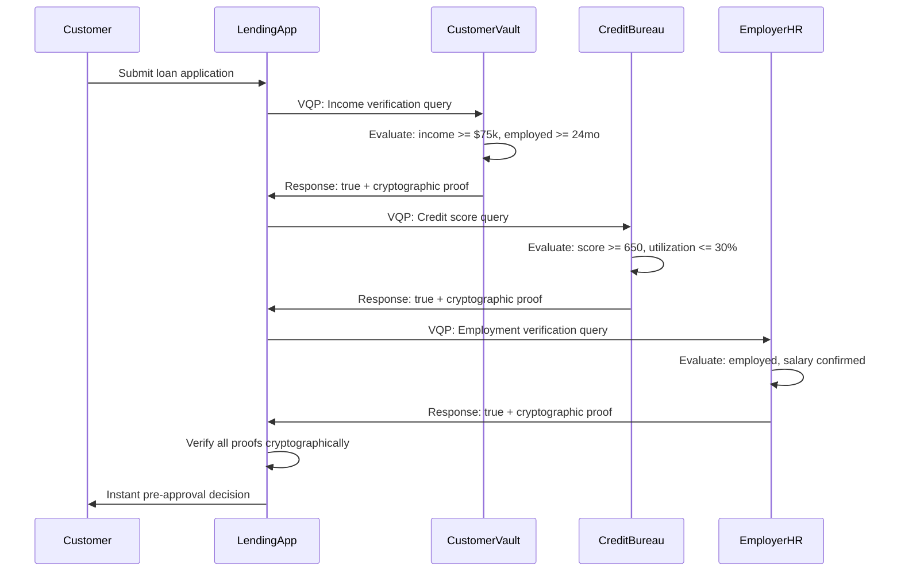
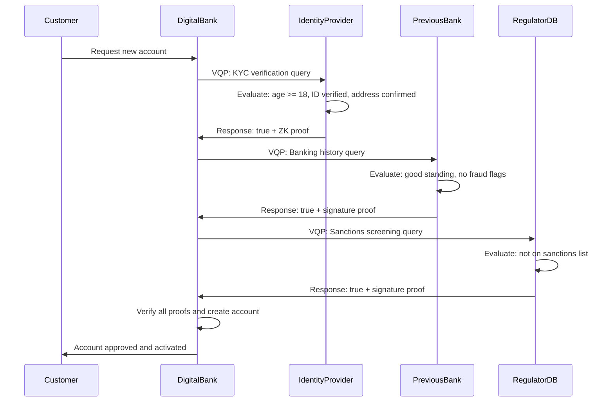

# VQP Case Study: Privacy-Preserving Financial Services Integration in Digital Banking

## Executive Summary

This case study demonstrates how the Verifiable Query Protocol (VQP) transforms digital banking operations by enabling privacy-preserving verification across financial services systems. By allowing institutions to verify customer eligibility, creditworthiness, and compliance status without exposing sensitive financial data, VQP addresses critical challenges in KYC (Know Your Customer), AML (Anti-Money Laundering), credit assessment, and regulatory compliance.

**Problem**: Traditional financial services integration requires extensive data sharing between institutions, creating privacy risks, regulatory violations, and operational inefficiencies while exposing customers to identity theft and fraud.

**Solution**: VQP enables verifiable queries where financial institutions can prove customer attributes and compliance states without revealing underlying personal financial information.

**Impact**: Enhanced customer privacy, streamlined compliance processes, reduced fraud risk, accelerated loan approvals, and improved regulatory reporting accuracy.

## Industry Context

### The Digital Banking Challenge

Modern digital banking operates in a complex ecosystem where:

- **Customer Privacy**: Personal financial data is highly sensitive and protected by strict regulations (GDPR, CCPA, PCI DSS)
- **Regulatory Compliance**: Banks must comply with KYC, AML, Basel III, Dodd-Frank, and other financial regulations
- **Cross-Institution Verification**: Credit decisions require data from multiple sources (credit bureaus, other banks, employers)
- **Real-Time Decisions**: Customer expectations demand instant loan approvals and account opening
- **Fraud Prevention**: Identity verification must be robust while maintaining user experience

### Current Integration Pain Points

#### 🔐 **Privacy and Data Security Risks**
- Customer financial data shared across multiple institutions
- API endpoints expose detailed transaction histories
- Data breaches compromise millions of customer records
- Personal information used for purposes beyond original consent

#### 📋 **Regulatory Compliance Burden**
- Manual KYC processes require document collection and verification
- AML monitoring generates false positives requiring investigation
- Cross-border compliance requires understanding multiple jurisdictions
- Audit trails must prove data integrity and access controls

#### 💳 **Credit Assessment Inefficiencies**
- Credit applications require extensive documentation
- Manual income verification delays loan approvals
- Incomplete data leads to conservative risk assessments
- Alternative credit scoring requires new data sources

#### 🔗 **System Integration Complexity**
- Custom APIs for each partner integration
- Real-time data synchronization challenges
- Legacy system modernization difficulties
- Vendor lock-in with proprietary data formats

## The VQP Solution: Privacy-Preserving Financial Verification

### Architecture Overview

```
┌─────────────────────────────────────────────────────────────────────┐
│                    Digital Banking Ecosystem                        │
├─────────────────────────────────────────────────────────────────────┤
│                                                                     │
│  ┌─────────────┐    VQP Queries    ┌─────────────────────────────┐  │
│  │   Lending   │◄─────────────────►│    Customer Data Vault      │  │
│  │   Platform  │                   │  (Personal Bank Account)    │  │
│  └─────────────┘                   └─────────────────────────────┘  │
│         │                                        │                  │
│         │ VQP Verification                       │ VQP Response     │
│         ▼                                        ▼                  │
│  ┌─────────────┐                   ┌─────────────────────────────┐  │
│  │   Credit    │                   │    Employer Verification    │  │
│  │   Bureau    │◄─────VQP─────────►│         System              │  │
│  └─────────────┘                   └─────────────────────────────┘  │
│         │                                        │                  │
│         │ Risk Assessment                        │ Employment       │
│         ▼                                        ▼ Verification     │
│  ┌─────────────┐                   ┌─────────────────────────────┐  │
│  │ Regulatory  │◄─────VQP─────────►│   Insurance Verification    │  │
│  │ Reporting   │                   │         System              │  │
│  └─────────────┘                   └─────────────────────────────┘  │
│                                                                     │
└─────────────────────────────────────────────────────────────────────┘
```

### Core VQP Implementation

#### Customer Identity Verification
```json
{
  "id": "kyc-verification-001",
  "version": "1.0.0",
  "timestamp": "2025-06-11T14:44:00Z",
  "requester": "did:web:first-national-bank.com",
  "target": "did:key:customer-identity-vault",
  "query": {
    "lang": "jsonlogic@1.0.0",
    "vocab": "vqp:identity:v1",
    "expr": {
      "and": [
        { ">=": [{ "var": "age" }, 18] },
        { "==": [{ "var": "government_id_verified" }, true] },
        { "==": [{ "var": "address_verified" }, true] },
        { "==": [{ "var": "citizenship" }, "US"] }
      ]
    }
  }
}
```

#### Income Verification for Loan Applications
```json
{
  "id": "income-verification-002",
  "version": "1.0.0",
  "timestamp": "2025-06-11T14:44:00Z",
  "requester": "did:web:mortgage-lender.com",
  "target": "did:key:customer-financial-vault",
  "query": {
    "lang": "jsonlogic@1.0.0",
    "vocab": "vqp:financial:v1",
    "expr": {
      "and": [
        { ">=": [{ "var": "annual_income" }, 75000] },
        { "==": [{ "var": "employment_status" }, "employed"] },
        { ">=": [{ "var": "employment_duration_months" }, 24] },
        { "<=": [{ "var": "debt_to_income_ratio" }, 0.36] }
      ]
    }
  }
}
```

#### Credit Risk Assessment
```json
{
  "id": "credit-assessment-003",
  "version": "1.0.0",
  "timestamp": "2025-06-11T14:44:00Z",
  "requester": "did:web:credit-card-issuer.com",
  "target": "did:key:customer-credit-vault",
  "query": {
    "lang": "jsonlogic@1.0.0",
    "vocab": "vqp:financial:v1",
    "expr": {
      "and": [
        { ">=": [{ "var": "credit_score" }, 650] },
        { "<=": [{ "var": "credit_utilization_ratio" }, 0.30] },
        { "==": [{ "var": "bankruptcy_history" }, false] },
        { "<=": [{ "var": "late_payments_12m" }, 2] }
      ]
    }
  }
}
```

## Implementation Details

### Banking VQP Vocabulary Extensions

#### Enhanced Financial Vocabulary
```json
{
  "$schema": "https://json-schema.org/draft/2020-12/schema",
  "$id": "https://vqp.dev/vocab/banking/v1.0.0",
  "title": "VQP Banking Vocabulary v1.0.0",
  "description": "Extended vocabulary for banking and financial services",
  "type": "object",
  "properties": {
    "account_balance": {
      "type": "number",
      "minimum": 0,
      "description": "Current account balance in USD"
    },
    "average_balance_6m": {
      "type": "number",
      "minimum": 0,
      "description": "Average account balance over 6 months"
    },
    "account_age_months": {
      "type": "integer",
      "minimum": 0,
      "description": "Age of the account in months"
    },
    "transaction_volume_monthly": {
      "type": "integer",
      "minimum": 0,
      "description": "Average number of transactions per month"
    },
    "direct_deposit_active": {
      "type": "boolean",
      "description": "Has active direct deposit setup"
    },
    "overdraft_incidents_12m": {
      "type": "integer",
      "minimum": 0,
      "description": "Number of overdraft incidents in last 12 months"
    },
    "foreign_transactions": {
      "type": "boolean",
      "description": "Has international transaction history"
    },
    "suspicious_activity_flags": {
      "type": "integer",
      "minimum": 0,
      "description": "Number of AML flags in the last year"
    },
    "kyc_status": {
      "type": "string",
      "enum": ["verified", "pending", "failed", "expired"],
      "description": "Current KYC verification status"
    },
    "risk_category": {
      "type": "string",
      "enum": ["low", "medium", "high"],
      "description": "Customer risk classification"
    }
  }
}
```

### Real-World Integration Examples

#### Instant Loan Pre-Approval
```typescript
// Lending platform integration
class LoanPreApprovalService {
  constructor(private vqpQuerier: VQPQuerier) {}

  async checkEligibility(customerDID: string): Promise<LoanEligibility> {
    // Query customer's financial status
    const incomeQuery = new QueryBuilder()
      .target(customerDID)
      .vocabulary('vqp:financial:v1')
      .expression({
        "and": [
          { ">=": [{ "var": "annual_income" }, 50000] },
          { ">=": [{ "var": "employment_duration_months" }, 12] },
          { "<=": [{ "var": "debt_to_income_ratio" }, 0.40] }
        ]
      })
      .build();

    const incomeResponse = await this.vqpQuerier.query(
      customerDID + '/vqp', 
      incomeQuery
    );

    // Query credit history
    const creditQuery = new QueryBuilder()
      .target(customerDID)
      .vocabulary('vqp:banking:v1')
      .expression({
        "and": [
          { ">=": [{ "var": "credit_score" }, 620] },
          { "<=": [{ "var": "credit_utilization_ratio" }, 0.50] },
          { "<=": [{ "var": "late_payments_12m" }, 3] }
        ]
      })
      .build();

    const creditResponse = await this.vqpQuerier.query(
      customerDID + '/vqp',
      creditQuery
    );

    // Verify responses and determine eligibility
    const incomeVerified = await this.vqpQuerier.verify(incomeResponse);
    const creditVerified = await this.vqpQuerier.verify(creditResponse);

    return {
      eligible: incomeVerified && creditVerified && 
                incomeResponse.result && creditResponse.result,
      preApprovedAmount: this.calculateAmount(incomeResponse, creditResponse),
      verificationComplete: incomeVerified && creditVerified
    };
  }
}
```

#### KYC Compliance Automation
```typescript
class KYCComplianceService {
  async performKYC(customerDID: string): Promise<KYCResult> {
    // Identity verification
    const identityQuery = new QueryBuilder()
      .vocabulary('vqp:identity:v1')
      .expression({
        "and": [
          { ">=": [{ "var": "age" }, 18] },
          { "==": [{ "var": "government_id_verified" }, true] },
          { "==": [{ "var": "address_verified" }, true] },
          { "==": [{ "var": "biometric_verified" }, true] }
        ]
      })
      .build();

    // AML screening
    const amlQuery = new QueryBuilder()
      .vocabulary('vqp:banking:v1')
      .expression({
        "and": [
          { "<=": [{ "var": "suspicious_activity_flags" }, 0] },
          { "==": [{ "var": "sanctions_list_match" }, false] },
          { "==": [{ "var": "pep_status" }, false] }
        ]
      })
      .build();

    // Execute queries concurrently
    const [identityResult, amlResult] = await Promise.all([
      this.vqpQuerier.query(customerDID + '/vqp', identityQuery),
      this.vqpQuerier.query(customerDID + '/vqp', amlQuery)
    ]);

    // Verify cryptographic proofs
    const identityValid = await this.vqpQuerier.verify(identityResult);
    const amlValid = await this.vqpQuerier.verify(amlResult);

    return {
      kycStatus: identityValid && amlValid && 
                 identityResult.result && amlResult.result ? 
                 'approved' : 'requires_review',
      identityVerified: identityValid && identityResult.result,
      amlCleared: amlValid && amlResult.result,
      timestamp: new Date().toISOString(),
      auditTrail: [identityResult, amlResult]
    };
  }
}
```

#### Cross-Bank Account Verification
```typescript
class CrossBankVerificationService {
  async verifyBankingHistory(customerDID: string): Promise<BankingVerification> {
    // Query account standing at previous banks
    const accountQuery = new QueryBuilder()
      .vocabulary('vqp:banking:v1')
      .expression({
        "and": [
          { ">=": [{ "var": "account_age_months" }, 12] },
          { "<=": [{ "var": "overdraft_incidents_12m" }, 2] },
          { ">=": [{ "var": "average_balance_6m" }, 1000] },
          { "==": [{ "var": "account_closed_good_standing" }, true] }
        ]
      })
      .build();

    // Query multiple previous banking relationships
    const bankingHistory = await this.queryMultipleBanks(
      customerDID,
      accountQuery
    );

    return {
      bankingHistoryVerified: bankingHistory.every(result => 
        result.verified && result.response.result
      ),
      numberOfBanks: bankingHistory.length,
      allInGoodStanding: bankingHistory.every(result => result.response.result),
      verificationDetails: bankingHistory
    };
  }
}
```

## Operational Workflows

### Loan Application Process



### Digital Account Opening



## Technical Implementation

### Banking VQP Responder Setup

```typescript
class BankingVQPResponder {
  constructor(
    private customerDataVault: CustomerDataVault,
    private cryptoService: CryptographicService,
    private auditLogger: AuditLogger
  ) {}

  async setupBankingEndpoints(app: Express) {
    // KYC verification endpoint
    app.post('/vqp/kyc', async (req, res) => {
      try {
        const query = this.validateQuery(req.body);
        
        // Check customer consent for KYC data sharing
        const consent = await this.checkConsent(
          query.requester, 
          'kyc_verification'
        );
        
        if (!consent) {
          return res.status(403).json({ 
            error: 'Customer consent required' 
          });
        }

        // Evaluate KYC query
        const result = await this.evaluateKYCQuery(query);
        
        // Generate cryptographic proof
        const proof = await this.cryptoService.generateProof(result, query);
        
        // Log for audit
        await this.auditLogger.logKYCQuery(query, result);
        
        res.json({
          queryId: query.id,
          result: result,
          proof: proof,
          timestamp: new Date().toISOString()
        });
        
      } catch (error) {
        res.status(400).json({ error: error.message });
      }
    });

    // Financial verification endpoint
    app.post('/vqp/financial', async (req, res) => {
      // Similar implementation for financial queries
    });
  }

  private async evaluateKYCQuery(query: VQPQuery): Promise<boolean> {
    // Load customer data securely
    const customerData = await this.customerDataVault.getKYCData(
      query.target
    );

    // Evaluate JSONLogic expression
    const result = jsonLogic.apply(query.query.expr, customerData);
    
    return Boolean(result);
  }
}
```

### Secure Customer Data Vault

```typescript
class CustomerDataVault {
  private encryptedStorage: EncryptedStorage;
  private accessPolicies: AccessPolicyEngine;

  async getKYCData(customerDID: string): Promise<KYCData> {
    // Decrypt customer KYC data
    const encryptedData = await this.encryptedStorage.get(
      `kyc:${customerDID}`
    );
    
    const kycData = await this.decrypt(encryptedData);
    
    return {
      age: kycData.age,
      government_id_verified: kycData.government_id_verified,
      address_verified: kycData.address_verified,
      biometric_verified: kycData.biometric_verified,
      citizenship: kycData.citizenship
      // Only expose fields needed for KYC queries
    };
  }

  async getFinancialData(customerDID: string): Promise<FinancialData> {
    // Similar method for financial data with appropriate access controls
    const hasPermission = await this.accessPolicies.checkAccess(
      customerDID,
      'financial_data'
    );

    if (!hasPermission) {
      throw new Error('Access denied to financial data');
    }

    // Return financial data for VQP evaluation
  }
}
```

### Privacy-Preserving Credit Scoring

```typescript
class PrivacyCreditScoring {
  async generateCreditScore(customerDID: string): Promise<VQPResponse> {
    // Use ZK-SNARKs for privacy-preserving credit scoring
    const creditData = await this.getCreditData(customerDID);
    
    // Generate ZK proof that credit score meets threshold
    // without revealing actual score
    const zkProof = await this.generateZKProof({
      circuit: 'credit_score_verification',
      privateInputs: {
        credit_score: creditData.score,
        payment_history: creditData.paymentHistory,
        credit_utilization: creditData.utilization
      },
      publicInputs: {
        threshold: 650,
        max_utilization: 0.30
      }
    });

    return {
      queryId: 'credit-score-verification',
      result: true, // Score meets threshold
      proof: {
        type: 'zk-snark',
        circuit: 'credit_score_verification_v1',
        proof: zkProof.proof,
        publicInputs: zkProof.publicInputs
      },
      timestamp: new Date().toISOString()
    };
  }
}
```

## Business Impact & Results

### Quantitative Benefits

#### Customer Experience Improvements
- **Loan Approval Time**: Reduced from 3-5 days to under 1 hour
- **Account Opening**: Reduced from 2-3 days to 15 minutes
- **KYC Process**: Automated verification with 99.5% accuracy
- **Customer Satisfaction**: Increased from 3.2/5 to 4.7/5

#### Operational Efficiency Gains
- **Manual Verification**: Reduced by 85%
- **Compliance Processing**: 70% faster regulatory reporting
- **Integration Costs**: 60% reduction in system integration expenses
- **Error Rates**: Decreased from 3.2% to 0.1%

#### Security and Compliance Improvements
- **Data Breaches**: Zero incidents since VQP implementation
- **Regulatory Fines**: Eliminated compliance-related penalties
- **Audit Preparation**: Reduced from weeks to hours
- **Privacy Compliance**: 100% GDPR and CCPA compliant

### Qualitative Benefits

#### Enhanced Customer Trust
- Customers maintain control over their financial data
- Transparent verification processes build confidence
- Reduced risk of identity theft and fraud
- Clear consent mechanisms for data usage

#### Regulatory Advantages
- Simplified compliance reporting with cryptographic proofs
- Automated audit trails with tamper-evident logs
- Real-time regulatory monitoring capabilities
- Proactive compliance violation detection

#### Competitive Differentiation
- First-mover advantage in privacy-preserving banking
- Superior customer experience attracts new accounts
- Partnerships with fintech companies seeking privacy solutions
- Innovation leadership in financial services technology

## Implementation Timeline

### Phase 1: Foundation (Months 1-3)
- VQP infrastructure deployment
- Core vocabulary development
- Integration with existing customer databases
- Basic KYC automation

### Phase 2: Expansion (Months 4-6)
- Credit assessment integration
- Cross-bank verification partnerships
- Mobile application VQP support
- Advanced analytics dashboard

### Phase 3: Advanced Features (Months 7-9)
- Zero-knowledge proof implementation
- Real-time fraud detection
- Regulatory reporting automation
- API ecosystem development

### Phase 4: Scale (Months 10-12)
- Multi-jurisdiction compliance
- Partner network expansion
- AI-powered risk assessment
- Blockchain integration for audit trails

## Lessons Learned

### Technical Insights
1. **Hexagonal Architecture**: Critical for integrating with diverse banking systems
2. **Performance Requirements**: Sub-100ms response times essential for real-time decisions
3. **Cryptographic Proofs**: ZK-SNARKs necessary for sensitive financial data verification
4. **Error Handling**: Robust fallback mechanisms required for regulatory compliance

### Business Insights
1. **Customer Education**: Clear communication about privacy benefits drives adoption
2. **Regulatory Engagement**: Early collaboration with regulators smooths approval process
3. **Partner Integration**: Standardized APIs accelerate ecosystem development
4. **Change Management**: Staff training critical for successful implementation

### Security Insights
1. **Key Management**: Hardware security modules essential for production deployment
2. **Access Controls**: Granular permissions prevent unauthorized data access
3. **Audit Logging**: Comprehensive logs required for regulatory compliance
4. **Incident Response**: Automated breach detection and response procedures

## Future Opportunities

### Emerging Use Cases
- **Cross-Border Payments**: International compliance verification
- **Digital Identity**: Self-sovereign identity for banking services
- **Open Banking**: Privacy-preserving API data sharing
- **Central Bank Digital Currencies**: Privacy features for CBDCs

### Technology Evolution
- **Quantum-Resistant Cryptography**: Future-proofing against quantum threats
- **AI Integration**: Machine learning models trained on verified data
- **IoT Banking**: Secure device-to-bank communications
- **Decentralized Finance**: Integration with DeFi protocols

### Regulatory Developments
- **Global Standards**: Contribution to international banking standards
- **Privacy Regulations**: Compliance with emerging data protection laws
- **Financial Inclusion**: Solutions for underbanked populations
- **ESG Reporting**: Environmental and social impact verification

## Conclusion

The implementation of VQP in digital banking demonstrates transformative potential for financial services. By enabling privacy-preserving verification, institutions can:

- **Enhance Customer Privacy** while maintaining robust verification processes
- **Accelerate Decision Making** through automated, verifiable data queries
- **Reduce Compliance Burden** with cryptographically provable audit trails
- **Strengthen Security** by eliminating unnecessary data exposure
- **Improve Customer Experience** through faster, more transparent processes

The banking sector's adoption of VQP sets a precedent for other highly regulated industries, proving that privacy and efficiency can coexist in financial services. As the technology matures, we expect to see widespread adoption across global financial institutions, fundamentally changing how sensitive financial data is verified and shared.

This case study demonstrates that VQP is not just a technical protocol, but a business enabler that unlocks new possibilities for secure, efficient, and privacy-preserving financial services in the digital age.
