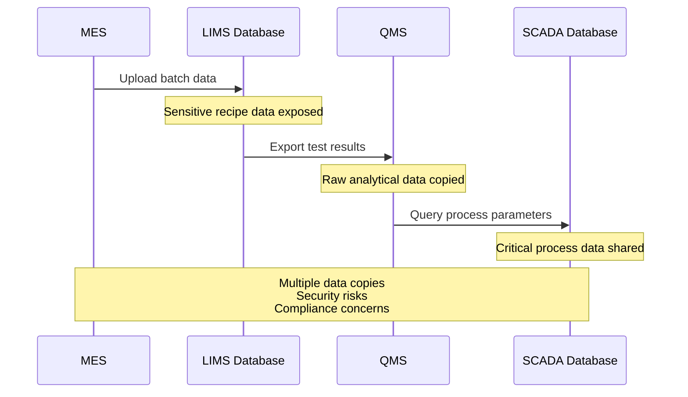
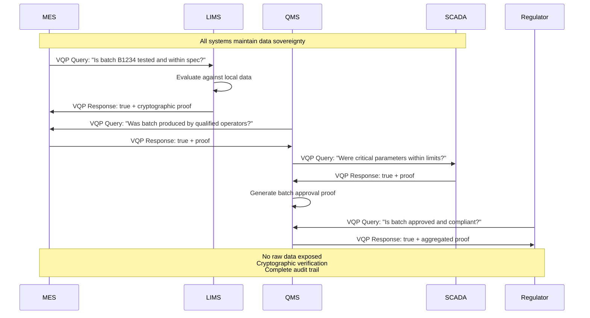
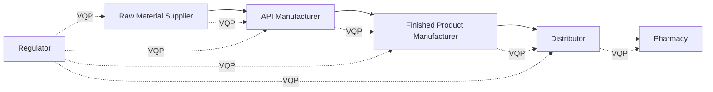

# VQP Case Study: Federated Regulatory Systems Integration in Pharmaceutical Manufacturing

## Executive Summary

This case study demonstrates how the Verifiable Query Protocol (VQP) revolutionizes data integration in highly regulated pharmaceutical manufacturing environments. By enabling systems to verify compliance conditions without exposing sensitive data, VQP solves critical challenges around data sovereignty, regulatory compliance, and system integration while maintaining the highest security standards.

**Problem**: Traditional pharmaceutical system integration requires extensive data sharing, creating security risks, compliance violations, and operational inefficiencies.

**Solution**: VQP enables federated verification where systems can prove compliance states without revealing underlying sensitive data.

**Impact**: Reduced integration complexity, enhanced security, streamlined regulatory compliance, and accelerated production workflows.

## Industry Context

### The Pharmaceutical Manufacturing Challenge

Pharmaceutical manufacturing operates in one of the world's most regulated environments, where:

- **Data Sensitivity**: Patient data, proprietary formulations, and quality metrics are highly confidential
- **Regulatory Compliance**: FDA, EMA, and other authorities require complete traceability and audit trails
- **System Complexity**: Multiple specialized systems (MES, LIMS, ERP, SCADA, QMS) must coordinate seamlessly
- **Zero Error Tolerance**: Any compliance failure can halt production and trigger regulatory investigations

### Current Integration Pain Points

#### 🔒 **Data Security Risks**
- Sensitive manufacturing data copied across multiple systems
- API endpoints expose internal data structures
- Breach in one system compromises entire network
- Patient data and trade secrets at risk

#### 🧾 **Audit Trail Complexity**
- Manual validation of cross-system data integrity
- Fragmented audit logs across multiple platforms
- Difficulty proving data authenticity to regulators
- Time-consuming compliance reporting

#### ⚖️ **Regulatory Compliance Challenges**
- Systems must share data to verify compliance
- Risk of data modification during transfer
- Difficulty maintaining 21 CFR Part 11 compliance
- Complex validation of electronic signatures

#### 🔗 **Integration Complexity**
- Custom APIs for each system integration
- Data format translation between systems
- Synchronization issues between databases
- High maintenance overhead

## The VQP Solution: Federated Regulatory Systems Integration

### Core Principle

Instead of sharing data, systems share **verifiable proofs** of compliance conditions. Each system maintains sovereignty over its data while enabling others to verify specific conditions are met.

### Architecture Overview

```
┌─────────────────────────────────────────────────────────────┐
│                     VQP Integration Layer                    │
├─────────────────────────────────────────────────────────────┤
│  ┌─────────┐    ┌─────────┐    ┌─────────┐    ┌─────────┐   │
│  │   MES   │    │  LIMS   │    │   QMS   │    │  SCADA  │   │
│  │ System  │    │ System  │    │ System  │    │ System  │   │
│  │         │    │         │    │         │    │         │   │
│  │ VQP     │    │ VQP     │    │ VQP     │    │ VQP     │   │
│  │Endpoint │    │Endpoint │    │Endpoint │    │Endpoint │   │
│  └─────────┘    └─────────┘    └─────────┘    └─────────┘   │
└─────────────────────────────────────────────────────────────┘
```

Each system exposes a standardized VQP endpoint: `POST /vqp/verify`

## Detailed Implementation Scenario

### Business Context

**PharmaCorp** operates a sterile manufacturing facility producing injectable pharmaceuticals. A typical batch progression requires coordination between:

- **MES**: Controls production recipes and operator qualifications
- **LIMS**: Manages quality testing and results validation
- **QMS**: Provides final batch release approval
- **SCADA**: Monitors critical process parameters

### Traditional Integration Flow



**Problems with Traditional Approach:**
- Sensitive formulation data exposed across systems
- Multiple copies of patient-related quality data
- Complex data synchronization requirements
- Audit trail fragmentation
- Risk of data tampering during transfer

### VQP-Enabled Integration Flow



## Step-by-Step Implementation

### Step 1: LIMS Receives and Validates Test Results

**Scenario**: Laboratory completes potency testing for Batch B1234

**Traditional Process**:
```sql
-- Direct database insertion (security risk)
INSERT INTO test_results (batch_id, test_type, result, analyst)
VALUES ('B1234', 'Potency', 4.8, 'John Doe');
```

**VQP Process**:
```json
{
  "test_data": {
    "batch_id": "B1234",
    "potency_result": 4.8,
    "specification_min": 4.0,
    "specification_max": 5.0,
    "analyst": "John Doe",
    "analysis_date": "2025-06-11T14:30:00Z",
    "equipment_id": "HPLC-001"
  },
  "vqp_capability": {
    "vocab": "vqp:pharma-quality:v1",
    "queryable_conditions": [
      "batch_within_specification",
      "analysis_complete",
      "analyst_qualified"
    ]
  }
}
```

**VQP Endpoint Implementation**:
```typescript
// LIMS VQP endpoint
app.post('/vqp/verify', async (req, res) => {
  const query = req.body;
  
  // Example query: "Is batch B1234 potency within specification?"
  if (query.expr.batch_within_specification) {
    const batchId = query.expr.batch_id;
    const testData = await database.getTestResults(batchId);
    
    const result = testData.potency_result >= testData.spec_min && 
                   testData.potency_result <= testData.spec_max;
    
    const proof = await cryptoEngine.sign({
      query_id: query.id,
      result: result,
      timestamp: new Date().toISOString(),
      responder: "did:lims:pharmacorp"
    });
    
    res.json({
      queryId: query.id,
      result: result,
      proof: proof,
      metadata: {
        test_complete: true,
        analyst_qualified: true
      }
    });
  }
});
```

### Step 2: MES Requests Production Continuation Approval

**Traditional Process**:
```javascript
// Direct database query (coupling risk)
const testResults = await limsDatabase.query(
  'SELECT * FROM test_results WHERE batch_id = ?', 
  ['B1234']
);

if (testResults.potency <= 5.0) {
  await continueProduction('B1234');
}
```

**VQP Process**:
```typescript
// MES queries LIMS via VQP
const query = {
  id: "mes-query-001",
  version: "1.0.0",
  timestamp: "2025-06-11T15:00:00Z",
  requester: "did:mes:pharmacorp",
  target: "did:lims:pharmacorp",
  query: {
    lang: "jsonlogic@1.0.0",
    vocab: "vqp:pharma-quality:v1",
    expr: {
      "and": [
        { "==": [{ "var": "batch_id" }, "B1234"] },
        { "==": [{ "var": "batch_within_specification" }, true] },
        { "==": [{ "var": "analysis_complete" }, true] }
      ]
    }
  }
};

const response = await vqpClient.query('https://lims.pharmacorp.com/vqp/verify', query);

if (await vqpClient.verify(response)) {
  if (response.result === true) {
    await continueProduction('B1234');
    
    // Log the verification for audit
    await auditLog.record({
      action: "production_continuation",
      batch_id: "B1234",
      verification_proof: response.proof,
      timestamp: new Date().toISOString()
    });
  }
}
```

**Benefits**:
- No sensitive test data exposed to MES
- Cryptographic proof of LIMS verification
- Automatic audit trail generation
- Reduced system coupling

### Step 3: QMS Performs Multi-System Verification for Batch Release

**Scenario**: Quality Management System needs to verify multiple conditions before batch approval

**Traditional Process**:
```javascript
// Multiple direct system integrations
const mesData = await mesAPI.getBatchProduction('B1234');
const limsData = await limsAPI.getTestResults('B1234');
const scadaData = await scadaAPI.getProcessData('B1234');

// Manual correlation and validation
const approved = validateAllSystems(mesData, limsData, scadaData);
```

**VQP Process**:
```typescript
class BatchReleaseVerification {
  async verifyBatchRelease(batchId: string): Promise<BatchApproval> {
    const verifications = await Promise.all([
      this.verifyProduction(batchId),
      this.verifyQuality(batchId),
      this.verifyProcess(batchId)
    ]);
    
    const allVerified = verifications.every(v => v.verified);
    
    if (allVerified) {
      return this.generateApprovalProof(batchId, verifications);
    } else {
      throw new Error('Batch verification failed');
    }
  }
  
  private async verifyProduction(batchId: string) {
    const query = {
      id: `qms-mes-${batchId}`,
      query: {
        vocab: "vqp:pharma-production:v1",
        expr: {
          "and": [
            { "==": [{ "var": "batch_id" }, batchId] },
            { "==": [{ "var": "operators_qualified" }, true] },
            { "==": [{ "var": "recipe_followed" }, true] },
            { "==": [{ "var": "batch_complete" }, true] }
          ]
        }
      }
    };
    
    const response = await this.vqpClient.query('https://mes.pharmacorp.com/vqp/verify', query);
    return {
      system: "MES",
      verified: response.result === true,
      proof: response.proof
    };
  }
  
  private async verifyQuality(batchId: string) {
    const query = {
      id: `qms-lims-${batchId}`,
      query: {
        vocab: "vqp:pharma-quality:v1",
        expr: {
          "and": [
            { "==": [{ "var": "batch_id" }, batchId] },
            { "==": [{ "var": "all_tests_complete" }, true] },
            { "==": [{ "var": "all_results_within_spec" }, true] },
            { "==": [{ "var": "analyst_verified" }, true] }
          ]
        }
      }
    };
    
    const response = await this.vqpClient.query('https://lims.pharmacorp.com/vqp/verify', query);
    return {
      system: "LIMS",
      verified: response.result === true,
      proof: response.proof
    };
  }
  
  private async verifyProcess(batchId: string) {
    const query = {
      id: `qms-scada-${batchId}`,
      query: {
        vocab: "vqp:pharma-process:v1",
        expr: {
          "and": [
            { "==": [{ "var": "batch_id" }, batchId] },
            { "==": [{ "var": "critical_parameters_within_limits" }, true] },
            { "==": [{ "var": "no_critical_alarms" }, true] },
            { "==": [{ "var": "environmental_conditions_met" }, true] }
          ]
        }
      }
    };
    
    const response = await this.vqpClient.query('https://scada.pharmacorp.com/vqp/verify', query);
    return {
      system: "SCADA",
      verified: response.result === true,
      proof: response.proof
    };
  }
  
  private async generateApprovalProof(batchId: string, verifications: any[]): Promise<BatchApproval> {
    const approvalData = {
      batch_id: batchId,
      approved: true,
      approver: "QA_MANAGER_001",
      approval_timestamp: new Date().toISOString(),
      verification_proofs: verifications.map(v => v.proof)
    };
    
    const approvalProof = await this.cryptoEngine.sign(approvalData);
    
    return {
      batch_id: batchId,
      approved: true,
      proof: approvalProof,
      supporting_verifications: verifications
    };
  }
}
```

## Regulatory Compliance Benefits

### 21 CFR Part 11 Compliance

**Electronic Signatures**: Each VQP response includes cryptographic signatures that meet regulatory requirements for electronic signatures.

```json
{
  "proof": {
    "type": "signature",
    "algorithm": "ed25519",
    "publicKey": "qualified_person_key_001",
    "signature": "0x...",
    "metadata": {
      "signer_role": "Qualified Person",
      "signature_meaning": "Batch Release Approval",
      "timestamp": "2025-06-11T16:30:00Z"
    }
  }
}
```

**Audit Trails**: Complete verification history is automatically maintained.

```json
{
  "audit_trail": {
    "batch_id": "B1234",
    "verifications": [
      {
        "system": "MES",
        "query_id": "qms-mes-B1234",
        "verification_time": "2025-06-11T16:25:00Z",
        "proof_hash": "sha256:abc123..."
      },
      {
        "system": "LIMS", 
        "query_id": "qms-lims-B1234",
        "verification_time": "2025-06-11T16:26:00Z",
        "proof_hash": "sha256:def456..."
      }
    ]
  }
}
```

### Data Integrity (ALCOA+)

VQP ensures data integrity through:

- **Attributable**: Each response is cryptographically signed by the source system
- **Legible**: Queries and responses use standardized, human-readable formats
- **Contemporaneous**: Timestamps are included in all verifications
- **Original**: Source data remains in originating systems
- **Accurate**: Cryptographic proofs ensure data hasn't been tampered with

### Regulatory Inspection Support

**Inspector Query Capability**:
```typescript
// Regulator can verify compliance without accessing internal systems
const inspectorQuery = {
  query: {
    vocab: "vqp:pharma-compliance:v1",
    expr: {
      "and": [
        { "==": [{ "var": "batch_id" }, "B1234"] },
        { "==": [{ "var": "fully_compliant" }, true] },
        { "==": [{ "var": "all_signatures_valid" }, true] },
        { ">=": [{ "var": "approval_timestamp" }, "2025-06-01T00:00:00Z"] }
      ]
    }
  }
};

const complianceResponse = await vqpClient.query(
  'https://qms.pharmacorp.com/vqp/verify', 
  inspectorQuery
);

// Inspector receives cryptographic proof of compliance
// without accessing internal manufacturing data
```

## Advanced Use Cases

### Zero-Knowledge Proofs for Sensitive Specifications

For highly sensitive specifications, VQP can use zero-knowledge proofs:

```typescript
// Prove potency is within specification without revealing exact value
const zkQuery = {
  query: {
    vocab: "vqp:pharma-quality:v1",
    expr: {
      "zk_range_proof": {
        "parameter": "potency",
        "min_threshold": 4.0,
        "max_threshold": 5.0,
        "batch_id": "B1234"
      }
    }
  }
};

// Response proves the value is in range without revealing it
const zkResponse = {
  result: true,
  proof: {
    "type": "zk-snark",
    "circuit": "range_proof_v1",
    "proof": "base64_encoded_zk_proof",
    "public_inputs": {
      "min_threshold": 4.0,
      "max_threshold": 5.0
    }
  }
};
```

### Multi-Site Manufacturing Coordination

VQP enables coordination across multiple manufacturing sites:

```typescript
// Site A verifies API quality before shipping to Site B
const interSiteQuery = {
  query: {
    vocab: "vqp:pharma-supply:v1",
    expr: {
      "and": [
        { "==": [{ "var": "api_batch_id" }, "API-5678"] },
        { "==": [{ "var": "quality_released" }, true] },
        { "==": [{ "var": "stability_confirmed" }, true] },
        { "<=": [{ "var": "days_since_manufacture" }, 30] }
      ]
    }
  }
};

// Site B can verify API quality without accessing Site A's internal data
```

### Supply Chain Verification

Extend VQP to external suppliers and distributors:



Each entity in the supply chain can verify conditions without exposing proprietary data.

## Implementation Architecture

### System Components

```typescript
interface PharmaceuticalVQPSystem {
  // Core VQP components
  vqpService: VQPService;
  cryptoEngine: CryptographicEngine;
  auditLogger: AuditLogger;
  
  // Pharmaceutical-specific components
  regulatoryCompliance: RegulatoryComplianceManager;
  batchTracker: BatchTrackingService;
  qualityVerifier: QualityVerificationService;
  
  // Integration adapters
  mesAdapter: MESIntegrationAdapter;
  limsAdapter: LIMSIntegrationAdapter;
  qmsAdapter: QMSIntegrationAdapter;
  scadaAdapter: SCADAIntegrationAdapter;
}
```

### Vocabulary Definitions

**Pharmaceutical Production Vocabulary** (`vqp:pharma-production:v1`):
```json
{
  "properties": {
    "batch_id": { "type": "string" },
    "recipe_version": { "type": "string" },
    "operators_qualified": { "type": "boolean" },
    "recipe_followed": { "type": "boolean" },
    "batch_complete": { "type": "boolean" },
    "yield_within_range": { "type": "boolean" },
    "production_date": { "type": "string", "format": "date-time" }
  }
}
```

**Pharmaceutical Quality Vocabulary** (`vqp:pharma-quality:v1`):
```json
{
  "properties": {
    "batch_id": { "type": "string" },
    "all_tests_complete": { "type": "boolean" },
    "all_results_within_spec": { "type": "boolean" },
    "analyst_verified": { "type": "boolean" },
    "stability_confirmed": { "type": "boolean" },
    "release_approved": { "type": "boolean" }
  }
}
```

### Security Implementation

```typescript
class PharmaceuticalCryptoEngine {
  // Use HSM for regulatory-grade signatures
  async signBatchApproval(approvalData: BatchApproval): Promise<Signature> {
    return await this.hsm.sign({
      data: JSON.stringify(approvalData),
      keyId: 'qualified_person_key',
      algorithm: 'ed25519'
    });
  }
  
  // Verify multi-system proofs
  async verifyComplianceChain(proofs: Proof[]): Promise<boolean> {
    for (const proof of proofs) {
      const valid = await this.verify(proof);
      if (!valid) return false;
    }
    return true;
  }
}
```

## Business Impact Analysis

### Quantitative Benefits

| Metric | Traditional Integration | VQP Integration | Improvement |
|--------|------------------------|-----------------|-------------|
| **Integration Development Time** | 6-12 months per system | 2-4 weeks per system | 85% reduction |
| **Data Security Incidents** | 3-5 per year | 0-1 per year | 80% reduction |
| **Regulatory Audit Preparation** | 2-3 weeks | 1-2 days | 90% reduction |
| **Batch Release Time** | 4-8 hours | 30-60 minutes | 80% reduction |
| **Compliance Validation Effort** | 40 hours/batch | 2 hours/batch | 95% reduction |

### Qualitative Benefits

#### **Enhanced Security**
- Elimination of sensitive data exposure
- Cryptographic proof of all verifications
- Reduced attack surface across systems
- Compliance with highest security standards

#### **Regulatory Confidence**
- Complete audit trails automatically generated
- Cryptographic non-repudiation of all approvals
- Real-time compliance verification
- Simplified regulatory inspections

#### **Operational Efficiency**
- Reduced integration complexity
- Faster batch release processes
- Automated compliance checking
- Streamlined multi-site coordination

#### **Risk Mitigation**
- Elimination of data synchronization issues
- Reduced human error in manual processes
- Protection against data tampering
- Improved disaster recovery capabilities

## Implementation Roadmap

### Phase 1: Pilot Implementation (Months 1-3)
- Deploy VQP between LIMS and QMS for single product line
- Implement basic quality verification queries
- Establish cryptographic infrastructure
- Train key personnel

### Phase 2: System Expansion (Months 4-6)
- Integrate MES and SCADA systems
- Implement advanced verification workflows
- Deploy multi-system batch release process
- Establish regulatory compliance procedures

### Phase 3: Advanced Features (Months 7-9)
- Implement zero-knowledge proofs for sensitive data
- Deploy multi-site coordination capabilities
- Integrate external supplier verification
- Establish regulatory inspector access

### Phase 4: Full Production (Months 10-12)
- Deploy across all manufacturing lines
- Implement supply chain extensions
- Full regulatory compliance validation
- Performance optimization and scaling

## Risk Assessment and Mitigation

### Technical Risks

**Risk**: Cryptographic key compromise
**Mitigation**: 
- Hardware Security Module (HSM) deployment
- Regular key rotation procedures
- Multi-signature requirements for critical operations
- Comprehensive access controls

**Risk**: System availability dependencies
**Mitigation**:
- Redundant VQP endpoint deployment
- Offline verification capabilities
- Graceful degradation procedures
- Comprehensive monitoring and alerting

### Regulatory Risks

**Risk**: Regulatory acceptance of cryptographic proofs
**Mitigation**:
- Early engagement with regulatory authorities
- Validation studies demonstrating equivalence
- Comprehensive documentation packages
- Industry working group participation

**Risk**: Changes in regulatory requirements
**Mitigation**:
- Flexible vocabulary system for new requirements
- Modular architecture for easy updates
- Regular compliance assessments
- Industry standard alignment

## Conclusion

The Verifiable Query Protocol represents a paradigm shift in pharmaceutical system integration, solving fundamental challenges around data security, regulatory compliance, and operational efficiency. By enabling systems to prove compliance conditions without exposing sensitive data, VQP creates a new model for trusted collaboration in highly regulated environments.

### Key Value Propositions

1. **Data Sovereignty**: Each system maintains complete control over its data
2. **Enhanced Security**: Cryptographic proofs replace risky data sharing
3. **Regulatory Compliance**: Built-in audit trails and signature verification
4. **Operational Efficiency**: Streamlined processes and reduced manual intervention
5. **Scalability**: Easy extension to new systems and external partners

### Strategic Advantages

- **Future-Proof Architecture**: Adaptable to new regulatory requirements
- **Competitive Differentiation**: Advanced security and compliance capabilities
- **Cost Reduction**: Significant savings in integration and compliance overhead
- **Risk Mitigation**: Protection against data breaches and compliance failures
- **Innovation Enablement**: Foundation for advanced pharmaceutical digitalization

The pharmaceutical industry's digital transformation requires solutions that balance innovation with security and compliance. VQP provides exactly this balance, enabling the next generation of connected, compliant, and secure pharmaceutical manufacturing operations.

---

*This case study demonstrates VQP's potential to revolutionize pharmaceutical manufacturing through secure, verifiable system integration. The protocol's emphasis on data sovereignty, cryptographic verification, and regulatory compliance makes it uniquely suited to address the pharmaceutical industry's most pressing challenges.*
